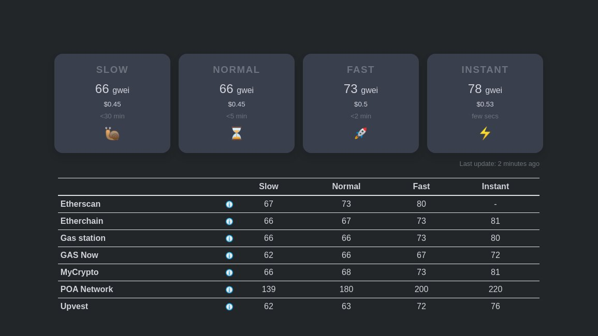

# ETH Gas.watch overview

ETH Gas.watch is an aggregated gas price feed that checks multiple data sources for the latest gas prices. By aggregating these data sources, it provides a more reliable, median gas price.

Visit [ethgas.watch](https://ethgas.watch/)

